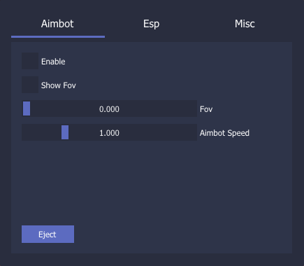

<h1>RedMatchHack Internal Cheat</h1>

WARNING: BEFORE INJECT THE GAME MUST BE IN WINDOWMODE OR BORDERLESS

INSERT -> Open the menu

END -> Eject the cheat

<h2>How to use</h2>

Install Microsoft DirectX SDK
 

Install Visual Studio 2022
 

Compile in release
 

Inject using any injector(ExtremeInjector,Xenos,CheatEngine)
 

<h2>UnkownCheats</h2>

https://www.unknowncheats.me/forum/unity/493714-redmatch-internal-hack.html

<h2>Features</h2>

<h4>-> Aimbot</h4>
<h4>-> Esp</h4>
<h4>-> Misc</h4>
<h4>-> GodMode<h4>
<h4>-> LimitFps <h4>
<h4>-> WeaponEditor<h4>

<h2>Menu</h2>

