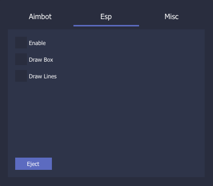
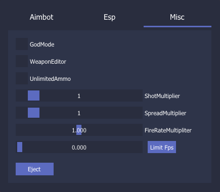

<h1>RedMatchHack</h1>

WARNING: BEFORE INJECT THE GAME MUST BE IN WINDOWMODE OR BORDERLESS

INSERT -> Open the menu

END -> Eject the cheat

<h2>How to use</h2>

Install Microsoft DirectX SDK
 

Install Visual Studio 2022
 

Compile in release
 

Inject using any injector(ExtremeInjector,Xenos,CheatEngine)
 

<h2>UnkownCheats</h2>

https://www.unknowncheats.me/forum/other-fps-games/456835-muck-cheat-dll.html

<h2>Features</h2>

<h4>Aimbot</h4>

-ShowFov

-AimbotSpeed

<h4>Esp</h4>

-DrawBox

-DrawLines

<h4>Misc</h4>

-GodMode

-LimitFps 

-WeaponEditor

--ChangeShots

--ChangeSpread

--ChangeFireRate

<h2>Menu</h2>

